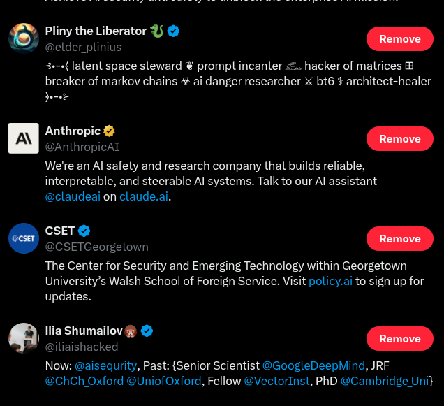

# Overview of Cybersecurity for AI Systems

### A whirlwind tour of modern cyber threats

The following cybersecurity tour is inspired by a talk presented by Simon Willison. But who is Simon Willison? Here we must take
a little digression. This is, in fact, a good thing and not a wrong practice. Many philosophers taught in this way. Here is
an example. "Hobbit" begins "In a hole in the ground there lived a hobbit." In the second paragraph, Tolkien asks, “But what is a hobbit?”
So, who is Simon Willison? He is a prominent software engineer and open-source creator, best known as a co-creator of the Django web framework 
and the creator of the Datasette tool for exploring and publishing data. He is also a well-regarded blogger who frequently writes about software architecture, data journalism, and the application of AI in development, 
with his work having influenced the cybersecurity community. 

Why is that important to you? Today, in the world of fake news, where many people pursue clicks, you must know who someone is before you put them in your X (Twitter) list.
So, as Shakespeare puts it, "Antonio is a good man," which many understand as "Antonio is sufficient." So, Simon is sufficient, and you can put him
on your list of people to watch. Here is how you do it.

1. On X/Twitter, click Lists on the left menu.
2. Click New List.
3. Give it a name: “Cybersecurity Pros”, “Cybersec Intel”, etc. Mine is call "Sec AI".
4. Choose Private (recommended).
5. Add accounts: go to any profile → click the “•••” menu → Add/remove from Lists.

Put Simon in this list https://x.com/simonw

**Tip!** As we proceed, I will provide suggestions on who to add to your X (Twitter) security list. Do not trust me. Verify them yourself first.

Here is what my list looks like to whet your appetite

And the current list is here: https://x.com/i/lists/1884478440427950554
